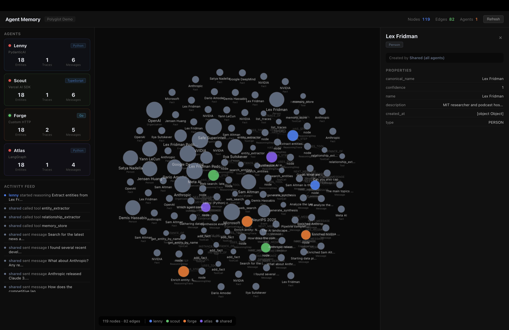

# neo4j-agent-memory TCK

[](https://neo4j.com/labs/)
[](LICENSE)
[](https://www.python.org/)
[](https://www.typescriptlang.org/)
[](https://go.dev/)
[](https://dotnet.microsoft.com/)
[](https://www.r-project.org/)

Technology Compatibility Kit for [neo4j-agent-memory](https://github.com/neo4j-labs/agent-memory) implementations.

The TCK provides a formal behavioral specification, **189 executable test scenarios**, and a compliance framework that enables any implementation — in any language — to verify conformance with the neo4j-agent-memory data model. It also ships TypeScript, Go, C#, R, and Python client libraries with framework integrations and a multi-agent reference demo.

> **Neo4j Labs Project** — This project is maintained by Neo4j Labs as an experimental, community-supported project. It is not officially supported by Neo4j. For community support, use [GitHub Issues](https://github.com/neo4j-labs/agent-memory-tck/issues).




## Two Endpoint Families

Every client speaks **two transports** behind one `MemoryClient` API:

| Transport | Endpoint shape | Used for |
|---|---|---|
| `RestTransport` | `https://memory.neo4jlabs.com/v1` | The **hosted Neo4j Agent Memory Service** — production deployments |
| `BridgeTransport` | `http://localhost:3001` (or any `/{snake_case_method}` server) | TCK conformance servers and the local reference adapter |

Selection is automatic based on the endpoint shape (any `/v1` segment routes through REST). Override with `transport: "rest" | "bridge"` (TS), `WithTransportMode(...)` (Go), `Transport = TransportMode.Rest` (C#), or `transport_mode = "rest"` (R / Python).

## Repository Contents

```
agent-memory-tck/
  tck/                  Python TCK specification + 189 test scenarios
  clients/typescript/   @neo4j-labs/agent-memory npm package
  clients/go/           agent-memory-go module
  clients/csharp/       Neo4j.AgentMemory .NET package
  clients/rlang/        neo4j.memory R package (httr2 + R6)
  clients/python/       neo4j-agent-memory-client Python package (httpx + asyncio)
  demo/                 6-agent polyglot demo (Python, TypeScript, Go, C#, R)
  docs/                 AsciiDoc documentation (Diataxis framework)
  SPEC.md               Normative specification (v1.0.0 + Volume 5)
```

| Component | Description |
|-----------|-------------|
| **TCK Specification** | 189 test scenarios across 4 compliance tiers, backed by `SPEC.md` |
| **Scenario Registry** | 189 stable scenario IDs (`SCN-B-001`…`SCN-G-018`, `SCN-P-001`…`SCN-P-011`) with SPEC clause traceability |
| **HTTP Bridge** | Cross-language conformance protocol — Python test suite validates TS, Go, C#, R, Python (or any) client |
| **TypeScript Client** | `@neo4j-labs/agent-memory` — `MemoryClient`, dual transport, Vercel AI middleware, LangChain JS, Mastra, 12-tool MCP |
| **Go Client** | `memory` package — context-aware API, functional options, generic `Entity[T]`, dual transport, MCP handler |
| **C# Client** | `Neo4j.AgentMemory` .NET 8 — async/await, dual transport, Semantic Kernel connector, MCP dispatcher |
| **R Client** | `neo4j.memory` — R6 classes, httr2 transport, ellmer integration, plumber conformance server |
| **Python Client** | `neo4j-agent-memory-client` — async, dual transport, LangGraph + PydanticAI integrations |
| **Multi-Agent Demo** | Lenny (Python/PydanticAI), Scout (TS/Vercel AI), Forge (Go), Atlas (Python/LangGraph), Sage (C#/Semantic Kernel), Rune (R/ellmer) |
| **Documentation** | AsciiDoc following the Diataxis framework — tutorials, how-to, reference, explanation |

## Compliance Tiers

| Tier | Scenarios | Scope |
|------|-----------|-------|
| **Bronze** | 93 | Schema compliance + short-term (conversational) memory |
| **Silver** | 67 | Bronze + long-term (entity/preference/fact) + reasoning (trace/step/tool call) |
| **Gold** | 18 | Silver + cross-memory + multi-agent sharing semantics |
| **Platinum** | 11 | Gold + Volume 5 / hosted-service operations (3-tier context, observations, reflections, feedback, history, graph view, provenance, Cypher) |

## Quick Start (Hosted Service)

The fastest path is against the hosted service at `https://memory.neo4jlabs.com/v1`. Get an API key from the [NAMS dashboard](https://memory.neo4jlabs.com/dashboard), then:

```bash
# Sanity-check the token
curl -H "Authorization: Bearer $MEMORY_API_KEY" \
  https://memory.neo4jlabs.com/v1/conversations
```

```typescript
// TypeScript
import { MemoryClient } from "@neo4j-labs/agent-memory";

const client = new MemoryClient({
  endpoint: "https://memory.neo4jlabs.com/v1",
  apiKey: process.env.MEMORY_API_KEY,
});

const conv = await client.shortTerm.createConversation({ userId: "alice" });
await client.shortTerm.addMessage(conv.id, "user", "Alice works at Acme Corp.");
const ctx = await client.shortTerm.getContext(conv.id);   // 3-tier context
```

See the full [hosted-service quickstart](docs/tutorials/hosted-quickstart.adoc) for Python, Go, C#, and R variants.

## Quick Start (TCK / Self-Hosted)

### Install the TCK

```bash
# Using uv (recommended)
uv add neo4j-agent-memory-tck

# Or with pip
pip install neo4j-agent-memory-tck
```

### Write an Adapter

Implement the `BaseAdapter` interface for your memory system:

```python
from tck.adapters.base_adapter import BaseAdapter, TCKMessage

class MyAdapter(BaseAdapter):
    async def setup(self) -> None: ...
    async def teardown(self) -> None: ...
    async def clear_all_data(self) -> None: ...

    async def add_message(self, session_id, role, content, *, metadata=None) -> TCKMessage:
        ...

    # ... implement remaining methods for your target tier (Platinum is opt-in)
```

### Register and Run

```python
# conftest.py
import pytest

@pytest.fixture(scope="session")
async def adapter():
    adapter = MyAdapter(uri="bolt://localhost:7687")
    await adapter.setup()
    yield adapter
    await adapter.teardown()
```

```bash
# Run Bronze tier (93 scenarios)
uv run pytest -m bronze -v

# Run all required tiers (Bronze + Silver + Gold = 178 scenarios)
uv run pytest -m "bronze or silver or gold" -v

# Run Platinum (hosted-service operations — 11 scenarios, opt-in)
uv run pytest -m platinum -v

# Generate compliance report
uv run pytest --json-report --json-report-file=results.json
uv run tck results.json --name "My Implementation" -o report.json --html report.html
```

### Cross-Language Testing

Test any language client via the HTTP bridge protocol:

```bash
# Start a conformance server (TypeScript example)
cd clients/typescript
MEMORY_ENDPOINT=https://memory.neo4jlabs.com/v1 \
  MEMORY_API_KEY=nams_... \
  npm run conformance:server

# Run the Python TCK against it
uv run pytest -m bronze --bridge-url http://localhost:3001 -v
```

## TypeScript Client

```typescript
import { MemoryClient } from "@neo4j-labs/agent-memory";

const client = new MemoryClient({
  endpoint: "https://memory.neo4jlabs.com/v1",
  apiKey: process.env.MEMORY_API_KEY,
});
await client.connect();

// Short-term memory
await client.shortTerm.addMessage(conv.id, "user", "Hello!");

// Long-term — full hosted operations
const graph = await client.longTerm.getEntityGraph();
const history = await client.longTerm.getEntityHistory(entityId);

// Reasoning provenance (Volume 5)
const provenance = await client.reasoning.getEntityProvenance(entityId);
```

Includes [Vercel AI middleware](clients/typescript/src/middleware/vercel-ai.ts), [LangChain JS](clients/typescript/src/integrations/langchain.ts), [Mastra](clients/typescript/src/integrations/mastra.ts), and the 12-tool [MCP surface](clients/typescript/src/mcp/index.ts). See the [TypeScript README](clients/typescript/README.md).

## Go Client

```go
client, _ := memory.New(
    memory.WithEndpoint("https://memory.neo4jlabs.com/v1"),
    memory.WithAPIKey(os.Getenv("MEMORY_API_KEY")),
)
defer client.Close(ctx)

conv, _ := client.ShortTerm.CreateConversation(ctx, memory.CreateConversationParams{
    UserID: "alice",
})
ctxView, _ := client.ShortTerm.GetContext(ctx, conv.ID)
graph, _ := client.LongTerm.GetEntityGraph(ctx)
```

Includes the 12-tool [MCP handler](clients/go/memory/mcp_handler.go). See the [Go README](clients/go/README.md).

## C# Client

```csharp
await using var client = new MemoryClient(new MemoryClientOptions {
    Endpoint = "https://memory.neo4jlabs.com/v1",
    ApiKey = Environment.GetEnvironmentVariable("MEMORY_API_KEY"),
});
await client.ConnectAsync();

var conv = await client.ShortTerm.CreateConversationAsync("alice");
await client.LongTerm.SetEntityFeedbackAsync(entityId, userScore: 0.95, confirmed: true);
var graph = await client.LongTerm.GetEntityGraphAsync();
```

Includes [Semantic Kernel](clients/csharp/src/Neo4j.AgentMemory/Integrations/SemanticKernel/MemoryConnector.cs) and [MCP dispatcher](clients/csharp/src/Neo4j.AgentMemory/Mcp/McpHandler.cs). See the [C# README](clients/csharp/README.md).

## R Client

```r
library(neo4j.memory)

client <- MemoryClient$new(
  endpoint = "https://memory.neo4jlabs.com/v1",
  api_key = Sys.getenv("MEMORY_API_KEY")
)

conv <- client$short_term$create_conversation(user_id = "alice")
ctx <- client$short_term$get_context(conv$id)
graph <- client$long_term$get_entity_graph()
```

Includes [ellmer integration](clients/rlang/neo4j.memory/R/integrations_ellmer.R) and an [MCP dispatcher](clients/rlang/neo4j.memory/R/mcp.R). See the [R README](clients/rlang/README.md).

## Python Client

```python
import asyncio
from neo4j_agent_memory_client import MemoryClient

async def main():
    async with MemoryClient(
        endpoint="https://memory.neo4jlabs.com/v1",
        api_key="nams_...",
    ) as client:
        conv = await client.short_term.create_conversation(user_id="alice")
        ctx = await client.short_term.get_context(conv.id)
        prov = await client.reasoning.get_entity_provenance(entity_id)

asyncio.run(main())
```

Distinct from the `neo4j-agent-memory` PyPI package (which is the reference *adapter* used by the TCK). Includes [LangGraph](clients/python/neo4j_agent_memory_client/integrations/langgraph.py) and [PydanticAI](clients/python/neo4j_agent_memory_client/integrations/pydantic_ai.py) integrations. See the [Python README](clients/python/README.md).

## Framework Integrations

| Framework | Language | Module |
|---|---|---|
| Vercel AI SDK | TypeScript | `@neo4j-labs/agent-memory/middleware/vercel-ai` |
| LangChain JS | TypeScript | `@neo4j-labs/agent-memory/integrations/langchain` |
| Mastra | TypeScript | `@neo4j-labs/agent-memory/integrations/mastra` |
| LangGraph | Python | `neo4j_agent_memory_client.integrations.langgraph` |
| PydanticAI | Python | `neo4j_agent_memory_client.integrations.pydantic_ai` |
| Semantic Kernel | C# | `Neo4j.AgentMemory.Integrations.SemanticKernel` |
| ellmer | R | `register_memory_tools()` |
| MCP | All | `https://memory.neo4jlabs.com/mcp` (12 tools) — also exposable via each client's `mcp` module |

See the [framework-integrations how-to](docs/how-to/framework-integrations.adoc) for end-to-end examples.

## Multi-Agent Demo

Six agents in five languages sharing one memory graph — locally or against the hosted service:

| Agent | Language | Framework | Role |
|-------|----------|-----------|------|
| **Lenny** | Python | PydanticAI | Podcast research, primary entity builder |
| **Scout** | TypeScript | Vercel AI SDK | Web search, graph enrichment |
| **Forge** | Go | Custom HTTP | Data pipeline, property enrichment |
| **Atlas** | Python | LangGraph | Orchestrator, cross-agent synthesis |
| **Sage** | C# | Semantic Kernel | Knowledge validation, conflict detection |
| **Rune** | R | ellmer | Statistical analysis, analytical reasoning |

```bash
# Local mode (dockerized Neo4j)
cd demo/infra
docker compose up

# Hosted mode (no local Neo4j)
MEMORY_API_KEY=nams_... docker compose \
    -f docker-compose.yml -f compose.hosted.yml up
```

Dashboard: http://localhost:3000.

## Documentation

Documentation is written in AsciiDoc following the [Diataxis framework](https://diataxis.fr/):

```bash
cd docs
make html         # Build HTML docs (requires asciidoctor)
make install-deps # Install asciidoctor if needed
```

| Section | Contents |
|---------|----------|
| **Tutorials** | [Getting Started](docs/tutorials/getting-started.adoc), [Hosted-Service Quickstart](docs/tutorials/hosted-quickstart.adoc), [First TypeScript Agent](docs/tutorials/first-typescript-agent.adoc) |
| **How-To** | [Authenticate](docs/how-to/authenticate.adoc), [Framework Integrations](docs/how-to/framework-integrations.adoc), [Writing an Adapter](docs/how-to/writing-an-adapter.adoc), [Cross-Language Testing](docs/how-to/cross-language-testing.adoc), [CI Integration](docs/how-to/ci-integration.adoc), [Certification](docs/how-to/certification.adoc) |
| **Reference** | [REST API](docs/reference/rest-api.adoc), [MCP Tools](docs/reference/mcp-tools.adoc), [BaseAdapter](docs/reference/base-adapter.adoc), [Bridge Protocol](docs/reference/bridge-protocol.adoc), [Compliance Tiers](docs/reference/compliance-tiers.adoc), [Scenario Registry](docs/reference/scenario-registry.adoc) |
| **Explanation** | [Architecture](docs/explanation/architecture.adoc), [Memory Model](docs/explanation/memory-model.adoc), [Multi-Agent Sharing](docs/explanation/multi-agent-sharing.adoc) |

## Certification Badges

Implementations that pass the TCK can display the appropriate badge:

```markdown


```

## Contributing

See [CONTRIBUTING.md](CONTRIBUTING.md) for development setup, coding standards, and contribution guidelines.

## Roadmap

See [ROADMAP.md](ROADMAP.md) for implementation status, gap analysis, and future plans.

## License

Apache 2.0 — See [LICENSE](LICENSE).
